# teler Proxy

teler Proxy enabling seamless integration with [teler WAF](https://github.com/kitabisa/teler-waf) to protect locally running web service against a variety of web-based attacks, such as OWASP Top 10 categories like cross-site scripting (XSS) or SQL injection, known vulnerabilities or exploits, malicious actors, botnets, unwanted crawlers or scrapers, and directory bruteforce attacks.

**See also:**

* [kitabisa/teler](https://github.com/kitabisa/teler): Real-time HTTP Intrusion Detection.
* [kitabisa/teler-waf](https://github.com/kitabisa/teler-waf): Go HTTP middleware that provides teler IDS functionality.

**Table of Contents**

* [Architecture](#architecture)
* [Install](#installation)
  * [from Source](#source)
  * [with Docker](#docker)
* [Usage](#usage)
  * [Options](#options)
* [Demo](#demo)
* [License](#license)

## Architecture

```mermaid
%% ---
%% title: teler WAF proxy architecture
%% ---
sequenceDiagram
    participant internet as Internet 🌐
    box Internal network
        participant proxy as teler-proxy 🔐
        participant server as Server 💻
    end

    internet->>proxy: request 🙋‍♂️

    Note over proxy: analyze request 🔍
    alt if "you're bad! 😈"
        proxy->>internet: early return 🏃
    else else 👍🏻
        proxy->>server: forward request ↪️
    end

    server-->>proxy: respond 💬
    proxy->>internet: "copy that!" ↩️
```



## Installation

### Source

Using [Go](https://golang.org/doc/install) (v1.19+) compiler:

```bash
CGO_ENABLED=1 go install github.com/kitabisa/teler-proxy/cmd/teler-proxy@latest
```

### — or

Manual building executable from source code:

```bash
git clone https://github.com/kitabisa/teler-proxy.git
cd teler-proxy/
make build
```

### Docker

Pull the [Docker](https://docs.docker.com/get-docker/) image by running:

```bash
docker pull ghcr.io/kitabisa/teler-proxy:latest
```

## Usage

Simply, `teler-proxy` can be run with:

```bash
teler-proxy -d <ADDR>:<PORT> [OPTIONS...]
```

### Options

Here are all the options it supports.

```bash
teler-proxy -h
```

|          **Flag**          |                            **Description**                            |
| -------------------------- | --------------------------------------------------------------------- |
| -p, --port `<PORT>`        | Set the local port to listen on **(default: 1337)**                   |
| -d, --dest `<ADDR>:<PORT>` | Set the destination address for forwarding requests                   |
| -c, --conf `<FILE>`        | Specify the path to the teler WAF configuration file                  |
| -f, --format `<FORMAT>`    | Specify the configuration file format (json/yaml) **(default: yaml)** |
| --cert `<FILE>`            | Specify the path to the SSL certificate file                          |
| --key `<FILE>`             | Specify the path to the SSL private key file                          |
| -V, --version              | Display the current teler-proxy version                               |
| -h, --help                 | Display this helps text                                               |

## Demo

To experience the power of the teler WAF Proxy in action, simply follow these steps to set up and run the demo located in the [demo/](/demo) directory.

## License

This program is developed and maintained by members of Kitabisa Security Team, and this is not an officially supported Kitabisa product. This program is free software: you can redistribute it and/or modify it under the terms of the [Apache-2.0 license](/LICENSE). Kitabisa teler-proxy and any contributions are copyright © by Dwi Siswanto 2023.