# teler Proxy

[](#)


teler Proxy enabling seamless integration with [teler WAF](https://github.com/kitabisa/teler-waf) to protect locally running web service against a variety of web-based attacks, such as OWASP Top 10 categories like cross-site scripting (XSS) or SQL injection, known vulnerabilities or exploits, malicious actors, botnets, unwanted crawlers or scrapers, and directory bruteforce attacks.

**See also:**

* [kitabisa/teler](https://github.com/kitabisa/teler): Real-time HTTP Intrusion Detection.
* [kitabisa/teler-waf](https://github.com/kitabisa/teler-waf): Go HTTP middleware that provides teler IDS functionality.

https://github.com/kitabisa/teler-proxy/assets/25837540/340dd31f-9686-4935-8522-806d95e815e1

---

**Table of Contents**

* [Architecture](#architecture)
* [Install](#installation)
  * [Binary](#binary)
  * [Source](#source)
  * [Docker](#docker)
* [Usage](#usage)
  * [Options](#options)
* [Configuration](#configuration)
  * [Excludes](#excludes)
  * [Whitelists](#whitelists)
  * [Customs](#customs)
  * [Customs from File](#customs-from-file)
  * [Log File](#log-file)
  * [No Stderr](#no-stderr)
  * [No Update Check](#no-update-check)
  * [Development](#development)
  * [In Memory](#in-memory)
  * [FalcoSidekick URL](#falcosidekick-url)
* [Demo](#demo)
* [Community](#community)
* [License](#license)

## Architecture

```mermaid
%% ---
%% title: teler WAF proxy architecture
%% ---
sequenceDiagram
    participant internet as Internet 🌐
    box Internal network
        participant proxy as teler-proxy 🔐
        participant server as Server 💻
    end

    internet->>proxy: request 🙋‍♂️

    Note over proxy: analyze request 🔍
    alt if "you're bad! 😈"
        proxy->>internet: early return 🏃
    else else 👍🏻
        proxy->>server: forward request ↪️
    end

    server-->>proxy: respond 💬
    proxy->>internet: "copy that!" ↩️
```



## Installation

### Binary

Simply, download a pre-built binary from [releases page](https://github.com/kitabisa/teler-proxy/releases). Unpack and run!

### Source

**Dependencies**:

* **gcc** (GNU Compiler Collection) should be installed & configured to compile teler-waf.

Using [Go](https://golang.org/doc/install) (v1.19+) compiler:

```bash
CGO_ENABLED=1 go install github.com/kitabisa/teler-proxy/cmd/teler-proxy@latest
```

### — or

Manual building executable from source code:

> **Warning**
> The `master` branch contains the latest code changes and updates, which might not have undergone thorough testing and quality assurance - thus, you may encounter instability and unexpected behavior.

```bash
git clone https://github.com/kitabisa/teler-proxy.git
cd teler-proxy/
make build
```

> **Note**
> :bulb: **ProTip**: If you're using Go version 1.20 or newer, you can build the executable file with our automatically generated default PGO<sup>[<a href="https://go.dev/doc/pgo">?</a>]</sup> profile to improve the performance by using `make build-pgo` command.

### Docker

Pull the [Docker](https://docs.docker.com/get-docker/) image by running:

```bash
docker pull ghcr.io/kitabisa/teler-proxy:latest
```

## Usage

Simply, `teler-proxy` can be run with:

```bash
teler-proxy -d <ADDR>:<PORT> [OPTIONS...]
```

### Options


Here are all the options it supports.

```bash
teler-proxy -h
```

|          **Flag**          |                            **Description**                            |
| -------------------------- | --------------------------------------------------------------------- |
| -p, --port `<PORT>`        | Set the local port to listen on **(default: 1337)**                   |
| -d, --dest `<ADDR>:<PORT>` | Set the destination address for forwarding requests                   |
| -c, --conf `<FILE>`        | Specify the path to the teler WAF configuration file                  |
| -f, --format `<FORMAT>`    | Specify the configuration file format (json/yaml) **(default: yaml)** |
| --cert `<FILE>`            | Specify the path to the SSL certificate file                          |
| --key `<FILE>`             | Specify the path to the SSL private key file                          |
| -V, --version              | Display the current teler-proxy version                               |
| -h, --help                 | Display this helps text                                               |

## Configuration

The configuration is provides a comprehensive set of options to fine-tune and tailor the behavior of the teler Web Application Firewall (WAF). Through the use of the teler WAF configuration (`-c`/`--conf`), you gain full control over how the WAF operates and responds to incoming traffic.

In case you opt not to provide a custom configuration file, the teler WAF will seamlessly apply a default configuration, ensuring that your application remains protected with sensible and reasonable settings.

The default configuration options are presented below in YAML format:

```yaml
excludes: []
whitelists: []
customs: []
customs_from_file: ""
response:
    status: 0
    html: ""
    html_file: ""
log_file: ""
no_stderr: false
no_update_check: false
development: false
in_memory: false
falcosidekick_url: ""
```

Or the equivalent in JSON format:

```json
{
  "excludes": [],
  "whitelists": [],
  "customs": [],
  "customs_from_file": "",
  "response": {
    "status": 0,
    "html": "",
    "html_file": ""
  },
  "log_file": "",
  "no_stderr": false,
  "no_update_check": false,
  "development": false,
  "in_memory": false,
  "falcosidekick_url": ""
}
```

By leveraging this versatile teler WAF configuration, you can fine-tune the WAF to perfectly align with your specific security requirements, ensuring maximum protection for your web service while enjoying the flexibility and power of teler WAF.

### Excludes

> **Warning**
> Threat exclusions (`Excludes`) will be deprecated in the upcoming teler-waf release (**v2**), use [`Whitelists`](#whitelists) instead. See [teler-waf#73](https://github.com/kitabisa/teler-waf/discussions/73).

Excludes (**excludes**) is a list of threat types (`[]int`) to exclude from the security checks. Please refer to the [docs](https://pkg.go.dev/github.com/kitabisa/teler-waf/threat#Threat).

### Whitelists

Whitelists (**whitelists**) is a list of DSL expressions (`[]string`) that match request elements that should be excluded from the security checks. Please refer to the [docs](https://github.com/kitabisa/teler-waf#dsl-expression).

### Customs

Customs (**customs**) is a list of custom security rules (`[]teler.Rule`) to apply to incoming requests.

These rules can be used to create custom security checks or to override the default security checks provided by teler-waf. Please refer to the [docs](https://github.com/kitabisa/teler-waf#custom-rules).

### Customs from File

Customs from file (**customs_from_file**) specifies the file path or glob pattern (`string`) for loading custom security rules. These rules can be used to create custom security checks or to override the default security checks provided by teler IDS.

The glob pattern supports wildcards, allowing you to specify multiple files or a directory with matching files. For example, "/path/to/custom/rules/\**/*.yaml" will load all YAML files in the "rules" directory and its subdirectories. Please refer to the [docs](https://github.com/kitabisa/teler-waf#custom-rules).

### Custom Response

Response (**response**) is the configuration for custom error response pages when a request is blocked or rejected. Please refer to the [docs](https://github.com/kitabisa/teler-waf#custom-response).

### Log File

Log file (**log_file**) is the file path (`string`) for the log file to store the security logs. If `log_file` is specified, log messages will be written to the specified file in addition to stderr (if `no_stderr` is **false**).

### No Stderr

No stderr (**no_stderr**) is a boolean flag indicating whether or not to suppress log messages from being printed to the standard error (stderr) stream.

When set to `true`, log messages will not be printed to stderr. If set to `false`, log messages will be printed to stderr. By default, log messages are printed to stderr (`false`).

### No Update Check

No update check (**no_update_check**) is a boolean flag indicating whether or not to disable automatic threat dataset updates.

When set to `true`, automatic updates will be disabled. If set to `false`, automatic updates will be enabled. By default, automatic updates are enabled (`false`). Please refer to the [docs](https://github.com/kitabisa/teler-waf#datasets).

### Development

Development (**development**) is a boolean flag that determines whether the request is cached or not. By default, development mode is disabled (`false`) or requests will cached. Please refer to the [docs](https://github.com/kitabisa/teler-waf#development).

### In Memory

In memory (**in_memory**) is a boolean flag that specifies whether or not to load the threat dataset into memory on initialization.

When set to `true`, the threat dataset will be loaded into memory, which can be useful when running your service or application on a distroless or runtime image, where file access may be limited or slow. If `in_memory` is set to `false`, the threat dataset will be downloaded and stored under the user-level cache directory on the first startup. Subsequent startups will use the cached dataset. Please refer to the [docs](https://github.com/kitabisa/teler-waf#datasets).

### FalcoSidekick URL

FalcoSidekick URL (**falcosidekick_url**) is the URL of the FalcoSidekick endpoint to which teler-waf's events will be forwarded.

This field should be set to the URL of your FalcoSidekick instance, including the protocol & port (e.g. "http://localhost:2801"). Please refer to the [docs](https://github.com/kitabisa/teler-waf#falco-sidekick).

## Demo

To experience the power of the teler WAF Proxy in action, simply follow these steps to set up and run the demo located in the [demo/](/demo) directory.

## Community

We use the Google Groups as our dedicated mailing list. Subscribe to [teler-announce](https://groups.google.com/g/teler-announce) via [teler-announce+subscribe@googlegroups.com](mailto:teler-announce+subscribe@googlegroups.com) for important announcements, such as the availability of new releases. This subscription will keep you informed about significant developments related to [teler IDS](https://github.com/kitabisa/teler), [teler WAF](https://github.com/kitabisa/teler-waf), [teler Proxy](https://github.com/kitabisa/teler-proxy), and [teler Resources](https://github.com/kitabisa/teler-resources).

For any [inquiries](https://github.com/kitabisa/teler-proxy/discussions/categories/q-a), [discussions](https://github.com/kitabisa/teler-proxy/discussions), or [issues](https://github.com/kitabisa/teler-proxy/issues) are being tracked here on GitHub. This is where we actively manage and address these aspects of our community engagement.

## License

This program is developed and maintained by members of Kitabisa Security Team, and this is not an officially supported Kitabisa product. This program is free software: you can redistribute it and/or modify it under the terms of the [Apache-2.0 license](/LICENSE). Kitabisa teler-proxy and any contributions are copyright © by Dwi Siswanto 2023.